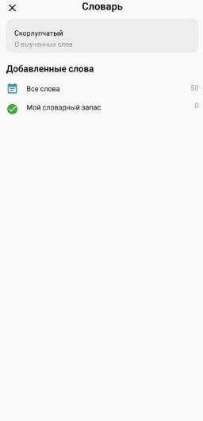
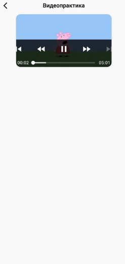

## English 
a mobile application that helps you learn English like SkyEnglish
## Architecture
This application follows the classic SOLID based clean architecture approach. This approach differs from official architecture guidance, but it is actively used by many developers.
## Features
- Hilt for DI
- Room for fast DB
- Coroutines
- MVVM
- ViewModel
- LiveData
- ExoPlayer for Video 
- Glide
- Navigation Graph for navigation
## Fragments
### Main Fragment

### Adult Cours

### Choose cours

### Dictionary Fragment 

### Notification Fragment 

### Profile Fragment

### Registration Fragment

### Task Fragment

### Video Fragment

